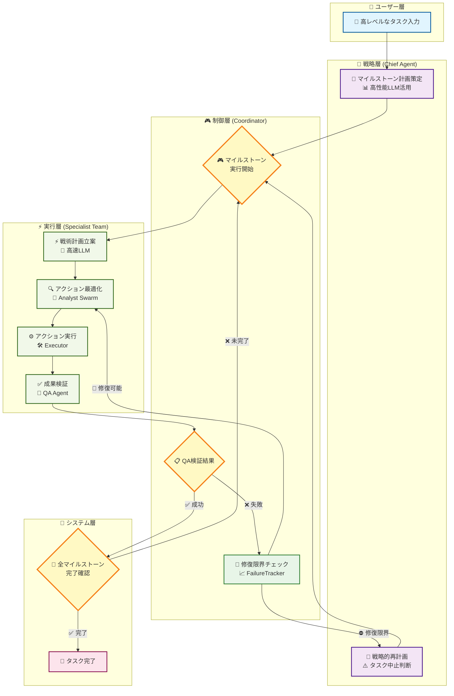

# Stagehand Agent Console

このプロジェクトは、AIを活用したブラウザ自動化フレームワーク [Stagehand](https://github.com/browserbase/stagehand) を基盤とし、**自己批評能力を持つ適応的階層型マルチエージェント・アーキテクチャ (AHAA)** を採用した高度な自律型AIエージェントのサンプルプロジェクトです。

司令塔となる**Chief Agent**が戦略的な**マイルストーン**を計画し、現場を監督する**Subgoal Coordinator**が専門エージェントチーム（**Analyst Swarm**）を率いて計画を戦術的な**サブゴール**に分解・実行します。エージェントは単にコマンドを実行するだけでなく、自らの行動結果を客観的な**完了条件**と照らし合わせて**検証（自己批評）**し、エラー発生時にはその原因を**反省**して**自己修復**を試みます。さらに、実行履歴から汎用的な操作を学習し、**新しいスキル（ツール）を動的に自動生成する**能力も備えています。

実行時やエラー発生時には、インタラクティブなデバッグコンソールが起動し、AIエージェントの自律的な動作をリアルタイムで監視・介入できます。

## ✨ 主な機能

- **適応的階層型マルチエージェント**: 司令塔AIが戦略的な「マイルストーン」を立案し、現場監督AIがそれを具体的な「サブゴール」に分解。専門家チーム（Analyst Swarm）が状況に応じて最適な分析手法（DOM, Vision, 履歴）を選択し、タスクを遂行します。

- **高度な自己修復と賢明なギブアップ**: 各ステップの実行後に**品質保証（QA）エージェント**が結果を客観的に検証します。失敗時には、そのフィードバックを基に**Analyst Swarm**が代替案を考案。失敗が繰り返されたり進捗が停滞したりすると**FailureTracker**がそれを検知し、最終的に司令塔がタスクの中止を判断できます。

- **永続的な長期記憶**: エージェントはタスクを通じて得た重要な情報（例：ログイン情報、抽出したデータ）を`workspace/memory.json`に保存します。これにより、**セッションを跨いで学習を継続**し、過去の経験を将来のタスクに活かすことができます。

- **安全な動的スキル生成**: 実行履歴から再利用可能な操作パターンを学習し、新しいツール（スキル）をTypeScriptコードとして自動生成します。生成されたスキルは、**人間によるレビューと承認ワークフロー (`npm run skill:review`)** を経てから有効化されるため、安全性と品質が保証されます。

- **柔軟なマルチLLM対応**: `.env`ファイルを変更するだけで、Google Gemini, Groq, OpenRouter, Cerebras上の様々なモデルを、役割（高性能/高速）に応じて簡単に切り替え可能です。

- **高度なツールセット**: マルチタブ操作、安全なローカルファイル読み書き、視覚AIによる画像認識・クリックなど、複雑なタスクを遂行するためのツールを標準装備しています。

- **対話型デバッグコンソール**: エラー発生時や任意のタイミングで起動し、AIとの対話や手動介入を可能にします。自律レベル（完全自動/確認/編集）も動的に変更可能です。

- **Playwrightテストとの統合**: エージェントの機能を通常のテストコードから呼び出せる非対話モードにより、CI/CDでの自動テストにも対応します。

## 🧠 エージェントアーキテクチャと思考サイクル

このエージェントは、複数のAIがそれぞれの役割を担い、以下の思考サイクルに基づいて自律的に動作します。

1.  **司令塔 (Chief Agent)**: ユーザーからの高レベルなタスクを受け取り、達成までの **マイルストーンリスト(計画)** を作成します。この際、各マイルストーンには、完了判定のための客観的な「**完了基準 (completionCriteria)**」を定義します。

2.  **現場監督 (Subgoal Coordinator)**: マイルストーンを一つずつ取り出し、それをさらに具体的な**サブゴール**のリストに分解。専門エージェントチームを指揮して達成を目指します。

3.  **専門エージェントチーム (Analyst Swarm)**:
    - **分析官 (Analyst Swarm: DOM / History / Vision)**: 現在の状況とサブゴールの説明に基づき、次に実行すべき**単一の最適なアクション**を計画します。状況（通常/エラー）に応じて専門家を動的に選択します。
    - **実行官 (Executor)**: 分析官が計画したアクションを忠実に実行し、結果を報告します。
    - **品質保証官 (QA Agent)**: 実行官の行動結果と、定義された「**成功条件**」を照合し、サブゴールが意味的に達成されたかを自己批評（検証）します。

4.  **ループと再計画**:
    - **戦術的自己修復**: QAの検証失敗や実行時エラーが発生した場合、現場監督はその失敗情報をチームにフィードバックし、Analyst Swarmはそれを考慮して次のアクションを計画します（Reflection）。
    - **戦略的再計画**: **FailureTracker**が解決不可能なループ（連続失敗・停滞など）を検知した場合、現場監督は司令塔に**再計画（マイルストーン再設計）**または**タスクの中止**を要求します。

このプロセスを図で示すと以下のようになります。



## 🛠️ セットアップ

### 1. プロジェクトのクローンと依存関係のインストール

まず、プロジェクトをクローンし、依存関係をインストールします。

```bash
# プロジェクトをクローン
git clone https://github.com/sella-roum/stagehand-agent-console.git
cd stagehand-agent-console

# 依存関係のインストール
npm install
```

### 2. 環境変数の設定

AI機能を利用するには、各種サービスのAPIキーが必要です。

`.env.example` ファイルをコピーして `.env` ファイルを作成し、利用したいAIプロバイダのAPIキーとモデル名を設定してください。

```bash
cp .env.example .env
```

次に、`.env` ファイルを開き、設定を編集します。**少なくとも1つのプロバイダのAPIキーとモデル名を設定し、`LLM_PROVIDER`で使用するプロバイダを指定してください。**

```.env
# .env

# --- Google Gemini Settings ---
GOOGLE_API_KEY="YOUR_GOOGLE_API_KEY"
GOOGLE_DEFAULT_MODEL="gemini-2.5-pro"
GOOGLE_FAST_MODEL="gemini-2.5-flash"

# --- Groq Cloud Settings ---
GROQ_API_KEY="YOUR_GROQ_API_KEY"
GROQ_DEFAULT_MODEL="llama3-70b-8192"
GROQ_FAST_MODEL="llama3-8b-8192"

# --- OpenRouter Settings ---
OPENROUTER_API_KEY="YOUR_OPENROUTER_API_KEY"
OPENROUTER_DEFAULT_MODEL="anthropic/claude-3.5-sonnet"
OPENROUTER_FAST_MODEL="google/gemini-flash-2.5"

# --- Cerebras Settings (新規追加) ---
CEREBRAS_API_KEY="YOUR_CEREBRAS_API_KEY"
CEREBRAS_DEFAULT_MODEL="gpt-oss-120b"
CEREBRAS_FAST_MODEL="llama-4-maverick-17b-128e-instruct"

# --- Provider Selection ---
# 'google', 'groq', 'openrouter', 'cerebras' を指定
LLM_PROVIDER="google"

# 'text' または 'vision' を指定。'vision' にすると画像認識を利用します。
AGENT_MODE="text"
```

- **`LLM_PROVIDER`**: `agent`コマンドが使用するAIプロバイダを選択します。
- **`*_API_KEY`**: 利用するサービスのAPIキーを設定します。
- **`*_DEFAULT_MODEL`**: 各プロバイダで、戦略計画などの高度な思考に使用する**デフォルトモデル**を指定します。
- **`*_FAST_MODEL`**: 各プロバイダで、戦術計画などの速度が求められる思考に使用する**高速モデル**を指定します。
- **`AGENT_MODE`**: `vision`に設定すると、Vision対応モデルによる画像認識が有効になります。

## 🚀 実行方法

### 対話型コンソールでの実行

セットアップが完了したら、以下のコマンドでプロジェクトを起動します。

```bash
npm start
```

スクリプトが起動すると、対話型デバッグコンソールが開始されます。`workspace`ディレクトリは、ファイル操作コマンドが初めて実行される際に自動的に作成されます。

### Playwrightテスト内での実行（非対話テストモード）

このエージェントは、通常のPlaywrightテストケース内で直接呼び出すことができます。これにより、AIエージェントの複雑な振る舞いをCI/CDパイプラインで自動的にテストすることが可能です。

`runAgentTask`関数をインポートし、`test`ブロック内で呼び出すだけで、指定したタスクをエージェントが非対話的に実行します。

**使用例: `tests/agent-demo.spec.ts`**

```typescript
import { test, expect } from "@playwright/test";
import { Stagehand } from "@browserbasehq/stagehand";
import StagehandConfig from "../stagehand.config";
import { runAgentTask } from "../src/agentRunner";

// テストのタイムアウトを5分に設定
test.setTimeout(300000);

test.describe("Stagehand AI Agent", () => {
  let stagehand: Stagehand;

  test.beforeEach(async () => {
    stagehand = new Stagehand({
      ...StagehandConfig,
      localBrowserLaunchOptions: { headless: true }, // テスト中はヘッドレスで実行
    });
    await stagehand.init();
  });

  test.afterEach(async () => {
    await stagehand.close();
  });

  test("should navigate to Stagehand GitHub and find the star count", async () => {
    // 1. 通常のPlaywright/Stagehandコードで初期状態を設定
    const page = stagehand.page;
    await page.goto("https://www.google.com");
    await page.act("'Stagehand AI'と入力して");
    await page.keyboard.press("Enter");
    await stagehand.page.waitForURL("**/search**");

    // 2. AIエージェントに後続のタスクを依頼
    const task =
      "Stagehandの公式サイトを見つけてアクセスし、GitHubリポジトリのスター数を報告して";

    const result = await runAgentTask(task, stagehand);

    // 3. エージェントの実行結果を検証
    expect(result.is_success).toBe(true);
    expect.soft(result.reasoning.toLowerCase()).toContain("star");
    expect(result.reasoning).toMatch(/\d+/); // 結果に数字が含まれているか

    // 4. 最終的なブラウザの状態を検証
    const finalUrl = stagehand.page.url();
    expect(finalUrl).toContain("github.com/browserbase/stagehand");
  });
});
```

## 🤖 コンソールの使い方

コンソールが起動したら、`>` プロンプトに対して以下のコマンドを入力できます。

| コマンド      | 説明                                                                       | 使用例                                                |
| :------------ | :------------------------------------------------------------------------- | :---------------------------------------------------- |
| **`agent`**   | **[推奨]** AIにタスクを依頼し、自律的に計画・実行・自己修復させます。      | `agent:StagehandのGitHubリポジトリのスター数を調べて` |
| **`act`**     | AIに単一の具体的な操作を自然言語で指示します。                             | `act:'Issues'タブをクリックして`                      |
| **`observe`** | 現在のページで操作可能な要素をAIに探させます。                             | `observe:クリックできる全てのボタン`                  |
| **`extract`** | ページから情報を抽出します。引数なしで全テキストを抽出。                   | `extract:記事のタイトル`                              |
| **`inspect`** | Playwright Inspectorを起動し、GUIでページを調査します。                    | `inspect`                                             |
| **`eval`**    | 任意のPlaywright/JavaScriptコードをその場で実行します。                    | `eval:console.log(await page.title())`                |
| **`goto`**    | 指定したURLにページを移動させます。                                        | `goto:https://www.stagehand.dev/`                     |
| **`mode`**    | 介入モードを設定 (`autonomous`, `confirm`, `edit`)。引数なしで現在値表示。 | `mode:autonomous`                                     |
| **`help`**    | コマンドの一覧を表示します。                                               | `help`                                                |
| **`exit`**    | デバッグコンソールを終了します。                                           | `exit`                                                |

## 💻 開発と規約

このプロジェクトでは、コードの品質と一貫性を保つためにPrettierとESLintを導入しています。

### コードのフォーマットとリント

コードをコミットする前に、以下のコマンドを実行してフォーマットと規約のチェックを行ってください。

```bash
# コード全体を自動フォーマット
npm run format

# ESLintで規約違反をチェック
npm run lint
```

### AIが生成したスキルのレビュー

エージェントが新しいスキルを生成すると、それは`workspace/skills/candidates/`ディレクトリに保存されます。以下のコマンドを実行して、対話形式でスキルをレビューし、承認または拒否してください。承認されたスキルは次回起動時からエージェントが利用可能になります。

```bash
npm run skill:review
```

### コメント規約

- **JSDoc**: `export`されるすべての関数、クラス、メソッドには、その役割、引数、戻り値を説明するJSDocを記述します。
- **インラインコメント**: 複雑なロジックや、一見して意図が分かりにくい処理の「**なぜ（Why）**」を説明するために使用します。
