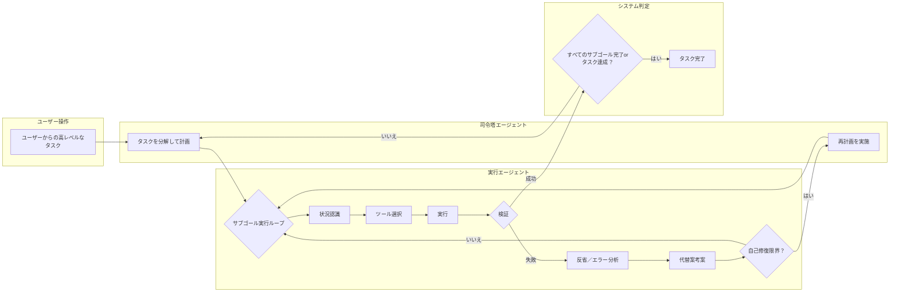

# Stagehand Agent Console

このプロジェクトは、AIを活用したブラウザ自動化フレームワーク [Stagehand](https://github.com/browserbase/stagehand) を基盤とし、**階層型マルチエージェント・アーキテクチャ**を採用した高度な自律型AIエージェントのサンプルプロジェクトです。

司令塔となる**Chief Agent**がタスクを計画し、現場担当の**Task Automation Agent**がそれを実行します。エージェントは単にコマンドを実行するだけでなく、自らの行動結果を**検証**し、エラー発生時にはその原因を**反省**して**自己修復**を試みます。さらに、実行履歴から汎用的な操作を学習し、**新しいスキル（ツール）を動的に自動生成する**能力も備えています。

実行時やエラー発生時には、インタラクティブなデバッグコンソールが起動し、AIエージェントの自律的な動作をリアルタイムで監視・介入できます。

## ✨ 主な機能

- **階層型マルチエージェント**: 司令塔AIがタスクを計画し、実行AIがサブゴールを一つずつ達成します。実行中の予期せぬ問題に対応するため、状況に応じて**動的な再計画**も行える、信頼性の高いアーキテクチャです。

- **高度な自己修復ループ**: 各ステップの実行後に結果を検証し、失敗した場合は**構造化されたエラー情報**を基に原因を自己分析します。これにより、より的確な代替案を考案し、タスクの続行を目指します。

- **永続的な長期記憶**: エージェントはタスクを通じて得た重要な情報（例：ログイン情報、抽出したデータ）を`workspace/memory.json`に保存します。これにより、**セッションを跨いで学習を継続**し、過去の経験を将来のタスクに活かすことができます。

- **安全な動的スキル生成**: 実行履歴から再利用可能な操作パターンを学習し、新しいツール（スキル）をTypeScriptコードとして自動生成します。生成されたスキルは、**人間によるレビューと承認ワークフロー (`npm run skill:review`)** を経てから有効化されるため、安全性と品質が保証されます。

- **マルチLLM対応**: `.env`ファイルを変更するだけで、Google Gemini, Groq, OpenRouter上の様々なモデルを簡単に切り替え可能です。

- **高度なツールセット**: マルチタブ操作、安全なローカルファイル読み書き、視覚AIによる画像認識・クリックなど、複雑なタスクを遂行するためのツールを標準装備しています。

- **対話型デバッグコンソール**: エラー発生時や任意のタイミングで起動し、AIとの対話や手動介入を可能にします。自律レベル（完全自動/確認/編集）も動的に変更可能です。

- **Playwrightテストとの統合**: エージェントの機能を通常のテストコードから呼び出せる非対話モードにより、CI/CDでの自動テストにも対応します。

## 🧠 エージェントアーキテクチャと思考サイクル

このエージェントは、2種類のAIが連携し、以下の思考サイクルに基づいて自律的に動作します。

1.  **司令塔エージェント (Chief Agent)**: ユーザーからの高レベルなタスクを受け取り、達成までの **サブゴールリスト(計画)** を作成します。

2.  **実行エージェント (Task Automation Agent)**: 計画リストからサブゴールを一つずつ取り出し、達成するまで**思考と行動のループ**を実行します。
    - `[ 状況認識 ] -> [ ツール選択 ] -> [ 実行 ] -> [ 検証 ]`
    - **失敗した場合 (戦術的修正)**: `[ 反省 (エラー分析) ] -> [ 代替案考案 ]` という自己修復ループに入ります。
    - **自己修復が複数回失敗した場合 (戦略的修正)**: 実行エージェントは司令塔に助けを求め、現在の状況をすべて伝えた上で、**タスク全体の再計画**を要求します。

3.  **ループ**: 一つのサブゴールが完了すると、エージェントはその経験を**記憶**に整理し、次のサブゴールを取得して実行を続けます。すべてのサブゴールが完了すると、タスク全体が終了します。

このプロセスを図で示すと以下のようになります。



## 🛠️ セットアップ

### 1. プロジェクトのクローンと依存関係のインストール

まず、プロジェクトをクローンし、依存関係をインストールします。

```bash
# プロジェクトをクローン
git clone https://github.com/sella-roum/stagehand-agent-console.git
cd stagehand-agent-console

# 依存関係のインストール
npm install
# または
pnpm install
```

### 2. 環境変数の設定

AI機能を利用するには、各種サービスのAPIキーが必要です。

`.env.example` ファイルをコピーして `.env` ファイルを作成し、利用したいAIプロバイダのAPIキーを設定してください。

```bash
cp .env.example .env
```

次に、`.env` ファイルを開き、設定を編集します。**少なくとも1つのプロバイダのAPIキーを設定し、`LLM_PROVIDER`で使用するプロバイダを指定してください。**

```.env
# .env

# --- Google Gemini Settings ---
GOOGLE_API_KEY="YOUR_GOOGLE_API_KEY"
GEMINI_MODEL="gemini-2.5-flash"

# --- Groq Cloud Settings ---
GROQ_API_KEY="YOUR_GROQ_API_KEY"
GROQ_MODEL="meta-llama/llama-4-scout-17b-16e-instruct"

# --- OpenRouter Settings ---
OPENROUTER_API_KEY="YOUR_OPENROUTER_API_KEY"
# モデル名は https://openrouter.ai/models で確認できます
OPENROUTER_MODEL=""

# --- Provider Selection ---
# 'google', 'groq', または 'openrouter' を指定
LLM_PROVIDER="google"

# 'text' または 'vision' を指定。'vision' にすると画像認識を利用します。
AGENT_MODE="text"

```

- **`LLM_PROVIDER`**: `agent`コマンドが使用するAIプロバイダを`google`, `groq`, `openrouter`の中から選択します。
- **`*_API_KEY`**: 利用するサービスのAPIキーを設定します。
- **`*_MODEL`**: 各プロバイダで使用するモデル名を指定します。
- **`AGENT_MODE`**: LLMモデルが画像認識を使用できる場合は、`vision`にすると画像認識を利用します。

## 🚀 実行方法

### 対話型コンソールでの実行

セットアップが完了したら、以下のコマンドでプロジェクトを起動します。

```bash
npm start
```

スクリプトが起動すると、対話型デバッグコンソールが開始されます。`workspace`ディレクトリは、ファイル操作コマンドが初めて実行される際に自動的に作成されます。

### Playwrightテスト内での実行（非対話テストモード）

このエージェントは、通常のPlaywrightテストケース内で直接呼び出すことができます。これにより、AIエージェントの複雑な振る舞いをCI/CDパイプラインで自動的にテストすることが可能です。

`runAgentTask`関数をインポートし、`test`ブロック内で呼び出すだけで、指定したタスクをエージェントが非対話的に実行します。

**使用例: `tests/agent-demo.spec.ts`**

```typescript
import { test, expect } from "@playwright/test";
import { Stagehand } from "@browserbasehq/stagehand";
import StagehandConfig from "../stagehand.config";
import { runAgentTask } from "../src/agentRunner";

// テストのタイムアウトを5分に設定
test.setTimeout(300000);

test.describe("Stagehand AI Agent", () => {
  let stagehand: Stagehand;

  test.beforeEach(async () => {
    stagehand = new Stagehand({
      ...StagehandConfig,
      localBrowserLaunchOptions: { headless: true }, // テスト中はヘッドレスで実行
    });
    await stagehand.init();
  });

  test.afterEach(async () => {
    await stagehand.close();
  });

  test("should navigate to Stagehand GitHub and find the star count", async () => {
    // 1. 通常のPlaywright/Stagehandコードで初期状態を設定
    const page = stagehand.page;
    await page.goto("https://www.google.com");
    await page.act("'Stagehand AI'と入力して");
    await page.keyboard.press("Enter");
    await stagehand.page.waitForURL("**/search**");

    // 2. AIエージェントに後続のタスクを依頼
    const task =
      "Stagehandの公式サイトを見つけてアクセスし、GitHubリポジトリのスター数を報告して";

    const result = await runAgentTask(task, stagehand);

    // 3. エージェントの実行結果を検証
    expect(result.is_success).toBe(true);
    expect.soft(result.reasoning.toLowerCase()).toContain("star");
    expect(result.reasoning).toMatch(/\d+/); // 結果に数字が含まれているか

    // 4. 最終的なブラウザの状態を検証
    const finalUrl = stagehand.page.url();
    expect(finalUrl).toContain("github.com/browserbase/stagehand");
  });
});
```

## 🤖 コンソールの使い方

コンソールが起動したら、`>` プロンプトに対して以下のコマンドを入力できます。

| コマンド      | 説明                                                                       | 使用例                                                |
| :------------ | :------------------------------------------------------------------------- | :---------------------------------------------------- |
| **`agent`**   | **[推奨]** AIにタスクを依頼し、自律的に計画・実行・自己修復させます。      | `agent:StagehandのGitHubリポジトリのスター数を調べて` |
| **`act`**     | AIに単一の具体的な操作を自然言語で指示します。                             | `act:'Issues'タブをクリックして`                      |
| **`observe`** | 現在のページで操作可能な要素をAIに探させます。                             | `observe:クリックできる全てのボタン`                  |
| **`extract`** | ページから情報を抽出します。引数なしで全テキストを抽出。                   | `extract:記事のタイトル`                              |
| **`inspect`** | Playwright Inspectorを起動し、GUIでページを調査します。                    | `inspect`                                             |
| **`eval`**    | 任意のPlaywright/JavaScriptコードをその場で実行します。                    | `eval:console.log(await page.title())`                |
| **`goto`**    | 指定したURLにページを移動させます。                                        | `goto:https://www.stagehand.dev/`                     |
| **`mode`**    | 介入モードを設定 (`autonomous`, `confirm`, `edit`)。引数なしで現在値表示。 | `mode:autonomous`                                     |
| **`help`**    | コマンドの一覧を表示します。                                               | `help`                                                |
| **`exit`**    | デバッグコンソールを終了します。                                           | `exit`                                                |

## 💻 開発と規約

このプロジェクトでは、コードの品質と一貫性を保つためにPrettierとESLintを導入しています。

### コードのフォーマットとリント

コードをコミットする前に、以下のコマンドを実行してフォーマットと規約のチェックを行ってください。

```bash
# コード全体を自動フォーマット
npm run format

# ESLintで規約違反をチェック
npm run lint
```

### AIが生成したスキルのレビュー

エージェントが新しいスキルを生成すると、それは`workspace/skills/candidates/`ディレクトリに保存されます。以下のコマンドを実行して、対話形式でスキルをレビューし、承認または拒否してください。承認されたスキルは次回起動時からエージェントが利用可能になります。

```bash
npm run skill:review
```

### コメント規約

- **JSDoc**: `export`されるすべての関数、クラス、メソッドには、その役割、引数、戻り値を説明するJSDocを記述します。
- **インラインコメント**: 複雑なロジックや、一見して意図が分かりにくい処理の「**なぜ（Why）**」を説明するために使用します。
